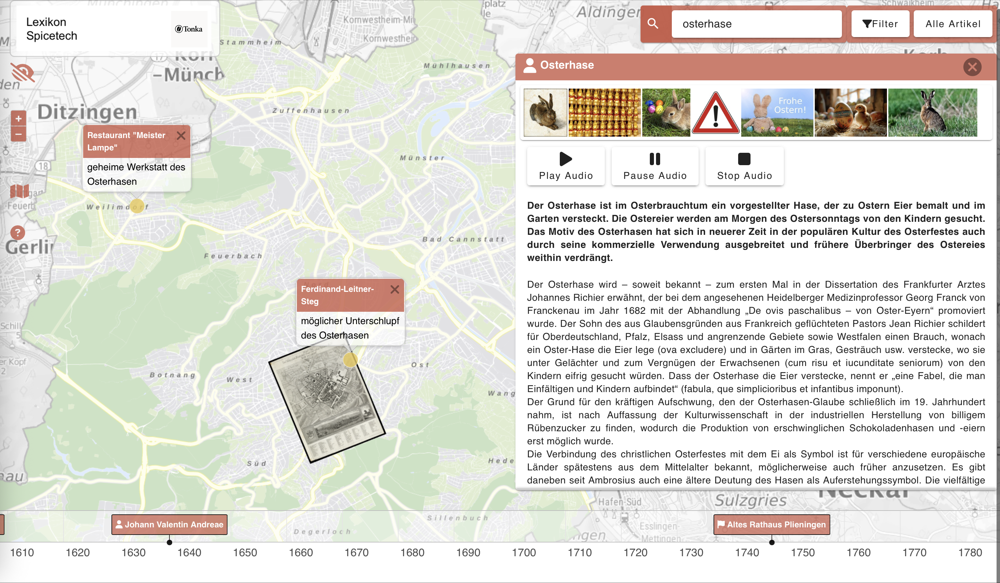

[]()
[](https://www.gnu.org/licenses/agpl-3.0.html)
[](https://hub.docker.com/r/USERNAME/REPOSITORY)
[](https://vuejs.org/)

# Tonka – die Bohne, aus der Stadtgeschichte wächst!

Geschichte muss nicht verstaubt sein – aber sie war es oft. In Archiven verborgen, nur Eingeweihten zugänglich, schwer auffindbar oder schlicht zu abstrakt für den Alltag. Gerade Stadtgeschichte – die uns alle umgibt – blieb lange unnahbar. Wer steckt hinter dem Straßennamen? Was geschah an diesem Platz? Und wo kann ich mich informieren, ohne erstmal in ein Archiv zu pilgern?

Das Stadtarchiv Stuttgart wollte das ändern – mit einer Lösung, die historisches Wissen modern zugänglich macht. 

Und so wurde das digitale, topographische Stadtlexikon, im Auftrag der Stadt Stuttgart entwickelt – in enger Zusammenarbeit mit dem Stadtarchiv und dem Stadtmessungsamt. So verbindet es wissenschaftliche Tiefe mit räumlicher Genauigkeit.



---

## Features
- eine intuitive Kartenansicht sowie historische Karten mit Vergleichsfunktion
- eine Zeitleiste, um Inhalte chronologisch einzuordnen
- eine Versionierung der Artikel sodass frühere Fassungen nachvollziehbar bleiben
- umfangreiche Bildergalerien, oft mit originalen Dokumenten, Fotos oder Karten
- modernste Webtechnologie – mit Fokus auf Barrierefreiheit, etwa durch ein kontrastreiches Farbschema oder eine Vorlesefunktion für die Artikel

---

## Voraussetzungen
- [Docker](https://www.docker.com/) (Version X oder höher)
- Weitere Abhängigkeiten (falls vorhanden)

---

## Installation
```
git clone https://github.com/SpicetechGmbH/tonka.git
```
---

### Test Container verwenden

#### 1. Container bauen

```bash
docker compose -f  docker-compose.yml build
```

#### 2. Container starten

```bash
docker compose -f  docker-compose.yml up
```

#### 3. URL aufrufen
```bash
http://localhost:8989
```

> **Hinweis**: Passe Ports, Volumes und Umgebungsvariablen nach Bedarf an.

---

## Lizenz

Dieses Projekt steht unter der **GNU Affero General Public License v3.0 (AGPL-3.0)**.  
Das bedeutet:
- Du darfst den Code verwenden, ändern und verbreiten.
- **Alle Änderungen** und **jede Nutzung über ein Netzwerk** (z.B. Web-Apps, APIs) erfordern, dass du den Quellcode veröffentlichst.
- Es gibt **keine Gewährleistung** (siehe Lizenztext).

Den vollständigen Lizenztext findest du unter:  
[https://www.gnu.org/licenses/agpl-3.0.html](https://www.gnu.org/licenses/agpl-3.0.html)

### Kommerzielle Lizenz & Support

Wenn du eine **kommerzielle Lizenz** benötigst oder Support für maßgeschneiderte Erweiterungen und Implementierungen wünschst, 
biete ich maßgeschneiderte **Support- und Lizenzvereinbarungen** an.
Dies umfasst:

- Professioneller Support
- Individuelle Anpassungen und Erweiterungen
- Garantierte Updates und Fehlerbehebung

Für weitere Informationen und Preisgestaltung kontaktiere mich bitte direkt unter:  
📧 tonka@spicetech.de
Oder besuche unsere Website: [www.spicetech.de](https://www.spicetech.de)

---

## Attribution

Diese Software basiert auf Technologien der **Spicetech GmbH**.  
Bei Verwendung ist ein Hinweis auf die Herkunft in geeigneter Form anzubringen, z.B. in der Dokumentation, im Impressum oder in der Benutzeroberfläche.

Beispiel:
> "Diese Anwendung verwendet Technologien der Spicetech GmbH."

Wir freuen uns, wenn ihr uns über eure Nutzung informiert!  
Mit eurer Zustimmung listen wir euer Projekt gerne auf unserer Website unter „trusted by Spicetech“.

## Kontakt
Spicetech GmbH
Gaisburgstr. 21
70182 Stuttgart

tonka@spicetech.de
