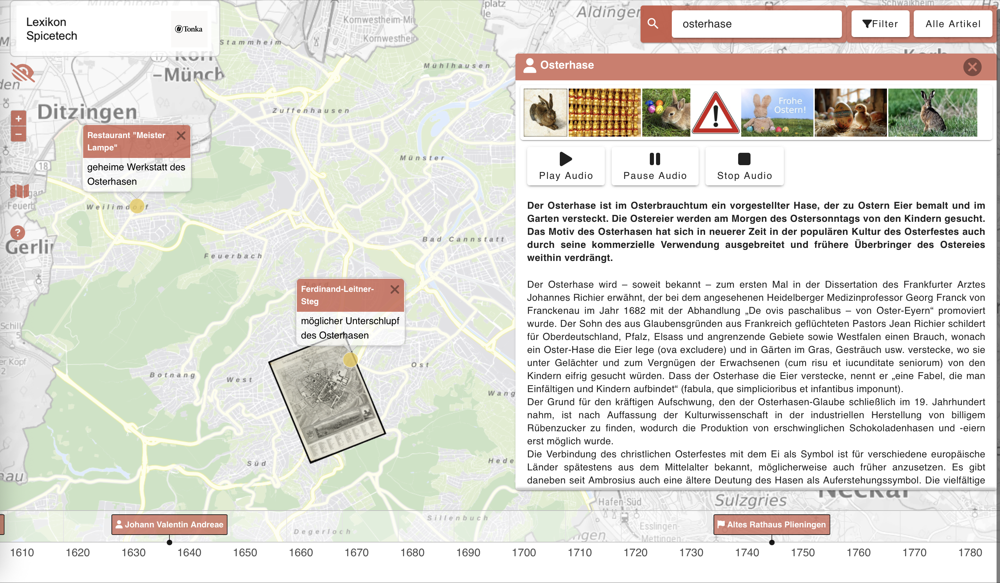
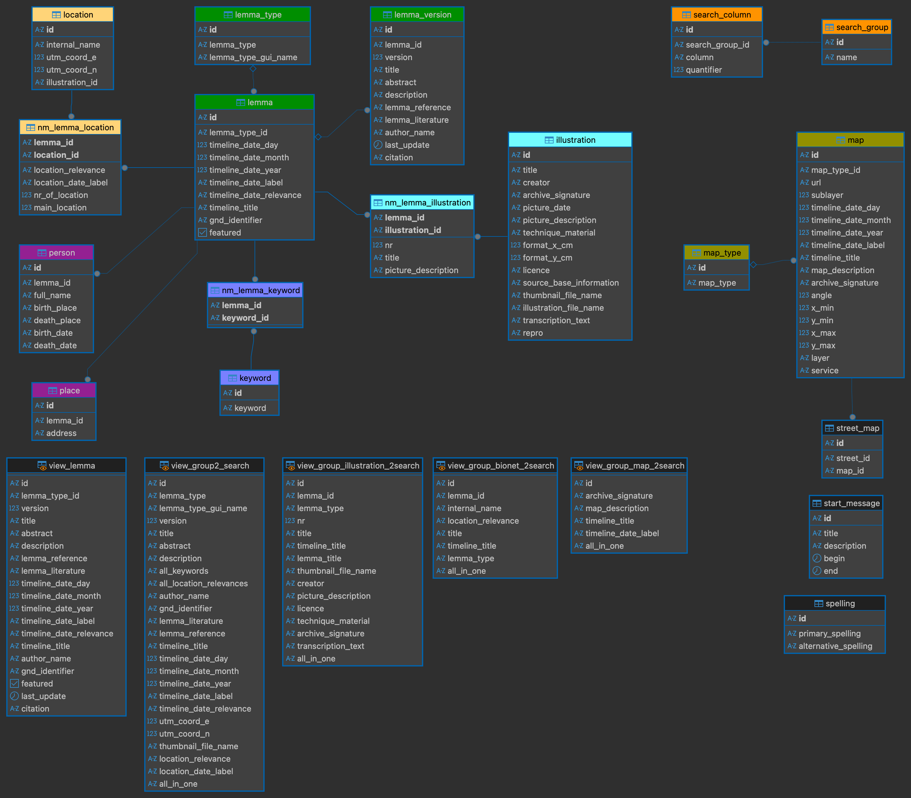

[]()
[](https://www.gnu.org/licenses/agpl-3.0.html)
[](https://hub.docker.com/r/USERNAME/REPOSITORY)
[](https://vuejs.org/)

# Tonka – die Bohne, aus der Stadtgeschichte wächst!

Geschichte muss nicht verstaubt sein – aber sie war es oft. In Archiven verborgen, nur Eingeweihten zugänglich, schwer auffindbar oder schlicht zu abstrakt für den Alltag. Gerade Stadtgeschichte – die uns alle umgibt – blieb lange unnahbar. Wer steckt hinter dem Straßennamen? Was geschah an diesem Platz? Und wo kann ich mich informieren, ohne erstmal in ein Archiv zu pilgern?

Das Stadtarchiv Stuttgart wollte das ändern – mit einer Lösung, die historisches Wissen modern zugänglich macht. 

Und so wurde das digitale, topographische Stadtlexikon, im Auftrag der Stadt Stuttgart entwickelt – in enger Zusammenarbeit mit dem Stadtarchiv und dem Stadtmessungsamt. So verbindet es wissenschaftliche Tiefe mit räumlicher Genauigkeit.



---
## Inhaltsverzeichnis
[[_TOC_]]

## Features
- eine intuitive Kartenansicht sowie historische Karten mit Vergleichsfunktion
- eine Zeitleiste, um Inhalte chronologisch einzuordnen
- eine Versionierung der Artikel sodass frühere Fassungen nachvollziehbar bleiben
- umfangreiche Bildergalerien, oft mit originalen Dokumenten, Fotos oder Karten
- modernste Webtechnologie – mit Fokus auf Barrierefreiheit, etwa durch ein kontrastreiches Farbschema oder eine Vorlesefunktion für die Artikel

### Redaktionssystem

Die Anwendung bringt kein Redaktionssystem für die Verwaltung und Pflege der Inhalte mit sich.
Die Erstellung und Betreuung eines solchen Systems liegt aktuell außerhalb des Entwicklungsbereichs zu diesem Projekt.
Zur Bearbeitung der Daten in der Datenbank wird ein eigenes Tool oder direkter Datenbankzugriff benötigt.

---

## Architekturüberblick

Die Anwendung folgt einer klaren Trennung in drei technische Schichten:

- **Frontend (Vue 3 + Vite):**
	Interaktive Kartenoberfläche, Suche, Artikelansicht, Zeitleiste und barrierearme Bedienung.
- **Backend (Java/Spring Boot):**
	API, Geschäftslogik, Datenvalidierung und Transportschicht mit Auslieferung der Inhalte an das Frontend.
- **Datenbank (PostgreSQL):**
	Persistenz der Lexikoninhalte, Lemmatypen, Lemmata, Lemmaversionen, Lokationen, Karten und weiterer Metadaten.

Im lokalen Setup werden diese Komponenten über Docker Compose gemeinsam gestartet.

---

## Datenmodell und fachliche Regeln

Dieser Abschnitt beschreibt die zentralen fachlichen Annahmen, die für Datenpflege, Import und Weiterentwicklung verbindlich sind.

### ER-Diagramm



*Abbildung: ER-Diagramm mit den zentralen Beziehungen zwischen `lemma`, `lemma_version`, `location`, `nm_lemma_location` und `lemma_type`; und den Views, die für die Suche der einzelnen Rubriken verwendet werden.*

[PNG in voller Größe öffnen](database/db-schema.png)

### Zentrale Entitäten

- **Lemma:** Der inhaltliche Haupteintrag (DB-Tabellen `lemma` und `lemma_version`).
- **Lokation:** Geografische Verortung eines Lemmas auf der Karte (DB-Tabelle `location`).
- **LemmaType:** Fachliche Klassifikation eines Lemmas inklusive Darstellung in der Oberfläche (DB-Tabelle `lemma_type`).

### Fachliche Invarianten

1. Jedes Lemma muss **exakt eine Hauptlokation** besitzen (Eintrag in DB-Tabelle `nm_lemma_location` mit Wert `1` in Spalte `main_location`).
1. Ein Lemma kann zusätzlich weitere Lokationen besitzen, für Netz-Darstellung (Einträge in `nm_lemma_location` mit Wert `0` in Spalte `main_location`).
1. Jedes Lemma muss einem gültigen LemmaType zugeordnet sein (`lemma.lemma_type_id`).
1. LemmaType-Werte in der Datenbank und die Icon-Zuordnung im Frontend müssen konsistent sein (siehe [Definition LemmaType](#definition-lemmatype)).

### Hinweise für Import und Pflege

- Datenimporte sollten die Invarianten vor dem Schreiben in die produktive Datenbank validieren.
- Änderungen an LemmaType-Bezeichnern müssen immer sowohl in der Datenbank als auch in der Frontend-Zuordnung gepflegt werden.
- Für redaktionelle Prozesse ohne integriertes CMS empfiehlt sich ein separates Qualitätssicherungs-Skript zur Prüfung der oben genannten Regeln.

---

## Voraussetzungen
- [Docker](https://www.docker.com/) (Version X oder höher)
- Weitere Abhängigkeiten (falls vorhanden)

---

## Installation
```
git clone https://github.com/SpicetechGmbH/tonka.git
```

### Test Container verwenden

#### 1. Container bauen

```bash
docker compose -f  docker-compose-full.yml build
```

#### 2. Container starten

```bash
docker compose -f  docker-compose-full.yml up
```

#### 3. URL aufrufen
```bash
http://localhost:8989
```

> **Hinweis**: Passe Ports, Volumes und Umgebungsvariablen nach Bedarf an.

---

## Konfiguration

Die Anwendung kann an einigen Stellen an die eigenen Anforderungen angepasst werden, ohne Anpassungen im Code vornehmen zu müssen, die umfängliche Programmierkenntnisse erfordern.
Diese Anpassungsmöglichkeiten, die zum Teil visuelle Modifikationen aber auch Änderungen in der Bedienung der Webanwendung ermöglichen, werden in den folgenden Abschnitten beschrieben.

Manche Anpassungen werden direkt in den Dateien vorgenommen, die den Code enthalten, andere werden über `.env`-Dateien gesetzt.

Alle Änderungen müssen vor dem Build der Anwendung durchgeführt werden.
Werden sie zu einem späteren Zeitpunkt gemacht, muss ein neuer Build erstellt und bereitgestellt werden.

### Startposition der Karte

Der Kartenausschnitt, der zu Beginn in der Anwendung geladen wird, kann über [`frontend/.env`](frontend/.env) definiert werden.
Mit den Werten für `VITE_START_CENTER_UTM_E` und `VITE_START_CENTER_UTM_N` wird das Zentrum des Kartenausschnitts festgelegt, hier werden UTM-Koordinaten erwartet.
Über `VITE_START_ZOOM` wird das initiale Zoomlevel gesetzt.
Diese Werte zusammengesetzt definieren somit den initialen Gesamtkartenausschnitt.

### Logo und weitere Informationen

Im oberen linken Bereich der Webanwendung befinden sich ein Schriftzug und ein Logo.
Das Logo wird aus der Datei `frontend/src/assets/logo_short.png` geladen und kann dementsprechend an dieser Stelle ersetzt werden.
Der Schriftzug wird in [Header.vue](frontend/src/components/Header.vue) definiert.
An dieser Stelle werden auch die Links die sich hinter diesen Elementen befinden definiert.
Der `href` für das Logo sollte entsprechend gesetzt werden, ein Klick auf den Schriftzug führt standardmäßig zur Seite **"Wir über uns"**.
Der Inhalt dieser Seite wird in [AboutView.vue](frontend/src/views/AboutView.vue) aufgebaut, und entspricht initial nur einem Platzhalter.

#### Links und Impressum

Bevor die Anwendung in einer frei zugänglichen Produktivumgebung bereitgestellt wird, müssen an mehreren Stellen Links, bspw. zu einer Datenschutzerklärung und einem Impressum, korrekt gesetzt werden, da die Anwendung selbst hierfür keine Unterseiten enthält.

In den folgenden Dateien müssen die Links dementpsrechend überarbeitet werden:

- [**`Footer.vue`**](frontend/src/components/Footer.vue)
- [**`HelpPage.vue`**](frontend/src/components/HelpPage.vue)
- [**`IllustrationComponent.vue`**](frontend/src/components/IllustrationComponent.vue)
- [**`PrintArticleComponent.vue`**](frontend/src/components/PrintArticleComponent.vue)
- [**`AboutView.vue`**](frontend/src/views/AboutView.vue)

### Farben

Zur farblichen Ausgestaltung der Webanwendung können die Primärfarben über wenige zentrale Stellen festegelegt werden.
Die Anwendug verwendet hierbei Vuetify-Theme, es gibt zwei Varianten, Standard und Barrierefrei, diese sind in [`vuetify.js`](frontend/src/plugins/vuetify.js) definiert und können hierüber frei angepasst werden.

Die Werte für `primary`, `secondary` und `accent` geben die Haupterscheinung der Anwengung vor.
Während über die `font-lvl`-Werte und über `-point-circle-stroke`, `-point-text` und `-point-text-stroke` weitere Akzente gesetzt und angepasst werden können.

### Featuredarstellung und Clusterverhalten

Die Darstellung der Feature und das Verhalten der Cluster auf der Karte kann über Variablen in [`frontend/.env`](frontend/.env) gesteuert werden.
Es lässt sich die dargestellte Größe der Feature und die Distanz ab wann sich Feature zu einem zusammenschließen bzw. auftrennen einstellen.
Die Größe der Feature lässt sich für jedes FeatureLayer separat einstellen.

Im folgenden sind die steuernden Variablen und ihre Standardwerte aufgeführt.

```.env
# frontend/.env

...
VITE_CLUSTER_DISTANCE=12
VITE_FEATURE_RADIUS=11
VITE_NET_FEATURE_RADIUS=11
VITE_RESULT_FEATURE_RADIUS=11
VITE_TOP_RESULT_FEATURE_RADIUS=13
...
```

Der Wert für `VITE_CLUSTER_DISTANCE` gibt an, ab welcher Distanz zueinander zwei Feature zu einem zusammengeführt werden.
Die Größe der Feature für die jeweiligen Layer wird mit den jeweiligen Variablen gesetzt, die Werte sind in Pixel angegeben.  
Mit `VITE_FEATURE_RADIUS` wird die Größe der Feature, die sich nicht in der aktuellen Ergebnismenge befinden, festgelegt.
Die Größe der Feature, die in einem Artikel mit Netz (ein Artikel, der mehrere Locations bestitzt) dargestellt werden, wird über `VITE_NET_FEATURE_RADIUS` gesteuert.
Die Größe der Feature in der Ergebnismenge wird mit `VITE_RESULT_FEATURE_RADIUS` und `VITE_TOP_RESULT_FEATURE_RADIUS` festgelegt.
Die ersten 5 Treffer werden mit `VITE_TOP_RESULT_FEATURE_RADIUS`, alle anderen Treffer mit `VITE_RESULT_FEATURE_RADIUS` Pixeln dargestellt.

### Buttons für Barrierefreiheitserklärung, leichte Sprache und Gebärdensprache

Die Buttons können unterschiedlich eingebunden und verwendet werden.
Sie können einen internen Dialog direkt in der Webanwendung anzeigen, sie können auf einen externen Link verweisen oder auch gänzlich deaktiviert, und damit ausgeblendet, werden.
Gesteuert wird das Grundverhalten über die Werte für die Variablen `VITE_A11Y_STATEMENT`, `VITE_PLAIN_LANGUAGE` und `VITE_SIGN_LANGUAGE` in der Datei [`frontend/.env`](frontend/.env).
Diese können unabhängig voneinander genutzt werden, folgen aber einer Funktionsweise.

#### Interner Dialog

Um den internen Dialog zu verwenden setzt man den Wert in [`frontend/.env`](frontend/.env) auf `internal`.

```.env
# frontend/.env

...
VITE_A11Y_STATEMENT=internal
VITE_PLAIN_LANGUAGE=internal
VITE_SIGN_LANGUAGE=internal
...
```

Der Inhalt des Dialogs wird in den Dateien [`A11yStatementDialog.vue`](frontend/src/components/A11yStatementDialog.vue), [`PlainLanguageDialog.vue`](frontend/src/components/PlainLanguageDialog.vue) und [`SignLanguageDialog.vue`](frontend/src/components/SignLanguageDialog.vue) gesetzt.

#### Externer Link

Um einen externen Link auf die Buttons zu legen, wird der jeweilige Link als Wert in [`frontend/.env`](frontend/.env) eingetragen.

```.env
# frontend/.env

...
VITE_A11Y_STATEMENT=https://www.beispiel.de/barrierefreiheit
VITE_PLAIN_LANGUAGE=https://www.beispiel.de/einfache_sprache
VITE_SIGN_LANGUAGE=https://www.beispiel.de/gebaerdensprache
...
```

Die Bezeichnung externe Links rührt daher, dass angenommen wird, dass der Link auf eine andere Web-Domain zeigt.
Die Links werden im Standardfall in einem neuen Browsertab geöffnet.

#### Deaktivieren und ausblenden der Buttons

Um die Buttons gänzlich auszublenden, können die Werte in [`frontend/.env`](frontend/.env) auf `false` gesetzt werden.

```.env
# frontend/.env

...
VITE_A11Y_STATEMENT=false
VITE_PLAIN_LANGUAGE=false
VITE_SIGN_LANGUAGE=false
...
```

### Definition LemmaType

Jedes Lemma wird einem in der Datenbank über die Tabelle LemmaType zugeordnet.
LemmaTypes können prinzipiell frei definiert werden, hierzu muss neben dem Eintrag in der Datenbank noch eine Funktion in der Webanwendung um das gewünschte Icon erweitert werden.

In der Datenbank wird in Tabelle `lemma_type` ein neuer Eintrag erstellt.  
Die Spalte `id` bekommt hier eine UUIDv4.
In Spalte `lemma_type` wird der Bezeichner des LemmaTyps eingetragen.
Über die Spalte `lemma_type_gui_name` kann optional ein Wert für die Bezeichnung gesetzt werden, die in der Webanwendung genutzt wird.
Gibt es hier keinen Eintrag wird der Wert aus `lemma_type` genutzt.

In der Datei `getLemmaIconByType.js` wird das Icon definiert.
Aktuell werden hier Fontawesome-Icons verwendet.
In die switch-case-Struktur wird ein neuer Eintrag an beliebiger Stelle über dem default-Eintrag hinzugefügt.
Der Wert für `case` entspricht dabei dem Eintrag aus der Datenbankspalte `lemma_type.lemma_type`.
Als `return`-Wert wird das Fontawesome-Icon als String eingetragen.
Die bisherigen Einträge in der Datei dienen hier auch aus Vorlage.

---

## Lizenz

Dieses Projekt steht unter der **GNU Affero General Public License v3.0 (AGPL-3.0)**.  
Das bedeutet:
- Du darfst den Code verwenden, ändern und verbreiten.
- **Alle Änderungen** und **jede Nutzung über ein Netzwerk** (z.B. Web-Apps, APIs) erfordern, dass du den Quellcode veröffentlichst.
- Es gibt **keine Gewährleistung** (siehe Lizenztext).

Den vollständigen Lizenztext findest du unter:  
[https://www.gnu.org/licenses/agpl-3.0.html](https://www.gnu.org/licenses/agpl-3.0.html)

### Kommerzielle Lizenz & Support

Wenn du eine **kommerzielle Lizenz** benötigst oder Support für maßgeschneiderte Erweiterungen und Implementierungen wünschst, 
biete ich maßgeschneiderte **Support- und Lizenzvereinbarungen** an.
Dies umfasst:

- Professioneller Support
- Individuelle Anpassungen und Erweiterungen
- Garantierte Updates und Fehlerbehebung

Für weitere Informationen und Preisgestaltung kontaktiere mich bitte direkt unter:  
📧 tonka@spicetech.de
Oder besuche unsere Website: [www.spicetech.de](https://www.spicetech.de)

---

## Attribution

Diese Software basiert auf Technologien der **Spicetech GmbH**.  
Bei Verwendung ist ein Hinweis auf die Herkunft in geeigneter Form anzubringen, z.B. in der Dokumentation, im Impressum oder in der Benutzeroberfläche.

Beispiel:
> "Diese Anwendung verwendet Technologien der Spicetech GmbH."

Wir freuen uns, wenn ihr uns über eure Nutzung informiert!  
Mit eurer Zustimmung listen wir euer Projekt gerne auf unserer Website unter „trusted by Spicetech“.

## Kontakt
Spicetech GmbH
Gaisburgstr. 21
70182 Stuttgart

tonka@spicetech.de
